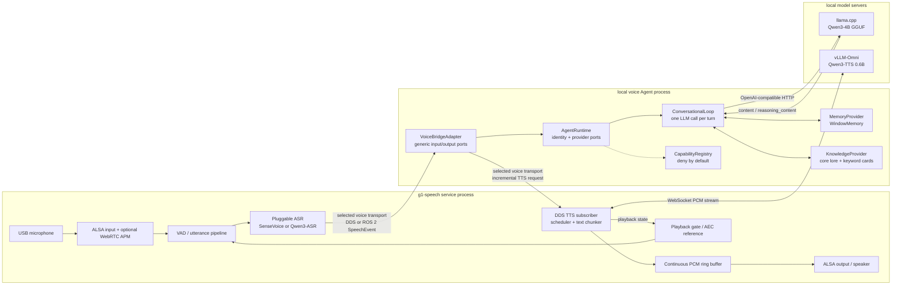

# Local offline voice Agent

The local robot voice loop has two compositions. On one Orin NX, the preferred
composition keeps ASR, Agent orchestration, and TTS scheduling in one Runtime:

```text
microphone -> VAD -> ASR -> in-process Agent -> in-process TTS -> speaker
```

The current llama.cpp and vLLM-Omni inference providers remain separate local
processes. For multiple GPUs or machines, the same components remain independently
replaceable through middleware:

```text
microphone -> VAD -> ASR -> DDS or ROS 2 SpeechEvent
                             |
                             v
                    Qwen3-4B llama.cpp
                             |
                     streaming text deltas
                             v
                DDS or ROS 2 TtsTextChunk -> Qwen3-TTS -> ALSA PCM
```

All endpoints bind to the robot itself. No cloud service or Internet connection
is involved.

## Start order

For the integrated Runtime, start the two current inference providers, then run:

```bash
.venv/bin/g1-speech runtime \
  --config config.tts-demo.local.json \
  --role-package roles/tifa-lockhart
```

The following split-process order is retained for distributed deployment and
transport debugging:

1. Start the Qwen3-TTS vLLM-Omni service on port 8091.
2. Start the speech service with the configured DDS or ROS 2 transport and
   `TTS_ENABLED=1`.
3. Start the llama.cpp Qwen3-4B server:

   ```bash
   scripts/run-qwen3-agent-llama.sh
   ```

4. Start the Agent Runtime voice adapter in another terminal:

   ```bash
   scripts/run-local-voice-agent.sh
   ```

The voice adapter subscribes to `rt/g1/hri/speech/final`; the runtime calls the OpenAI-compatible
llama.cpp endpoint at `http://127.0.0.1:8080/v1/chat/completions`, and publishes
incremental answer fragments to `rt/g1/hri/tts/request`. The existing text
chunker and continuous PCM player preserve Agent/TTS/playback overlap.

The default prompt disables long answers and the generic Agent request disables
Qwen3 thinking. Four conversation turns are retained within the 4096-token
single-user context. Override these settings without editing project files:

```bash
scripts/run-local-voice-agent.sh \
  --system-prompt "你是雪宝机器人。用活泼、简短的中文回答。" \
  --history-turns 3 \
  --max-tokens 64
```

Thinking is opt-in and can be bounded per request. Reasoning deltas are consumed
by the model provider but never published to TTS:

```bash
scripts/run-local-voice-agent.sh \
  --thinking \
  --thinking-budget-tokens 12 \
  --max-tokens 64
```

The 12-token budget is a low-thinking profile for short robot dialogue. It adds
some time before the first spoken token; use `--no-thinking` for the lowest
possible response latency. The bundled Tifa launcher uses a compact canonical
lore provider instead of thinking and retains three completed conversation
turns. In optional thinking mode the
bridge requests llama.cpp's structured `reasoning_content`, inserts a short
budget-expiry instruction, and buffers the final answer until `finish_reason`
confirms completion. A length-truncated or unterminated reasoning response is
rejected before any text reaches DDS/TTS.

## Runtime architecture



`VoiceBridgeAdapter` is the transport-independent boundary between the robot's
ears and mouth. `IntegratedRuntime` binds it to `InProcessTransport`; the distributed
application composition selects DDS or ROS 2 ports from `transport.backend`.
`AgentRuntime` owns identity and replaceable loop/provider ports;
`ConversationalLoop` deliberately remains a single model call. `WindowMemory`
stores only a bounded number of completed turns in host RAM. Capability access
is deny-by-default and dormant until a provider is explicitly registered and
invoked. None of these objects loads a CUDA library or owns model weights.

Role lore is a separate provider from conversation memory. Fixed core lore stays
in the cacheable system prefix; a dependency-free keyword provider selects at
most a few multilingual fact cards for the current utterance. There is no
embedding model, vector database, network request, or additional LLM call.

Reusable characters live in versioned Role Packages under `roles/` and are
loaded with `--role-package`. See [Role Packages](role_packages.md).
The bundled Olaf profile has a convenience launcher:

```bash
scripts/run-olaf-voice-agent.sh
```

The generic equivalent is:

```bash
scripts/run-local-voice-agent.sh --role-package roles/olaf
```

Character launchers can also pin a TTS voice and language per DDS request. The
bundled Japanese Tifa profile uses the Qwen3-TTS `Ono_Anna` preset:

```bash
scripts/run-tifa-voice-agent.sh
```

Its generic equivalent is:

```bash
scripts/run-local-voice-agent.sh --role-package roles/tifa-lockhart
```

The voice adapter ignores ASR events older than five seconds. This prevents the DDS
reliable outbox from replaying questions accumulated before the Agent started.
Use `--max-speech-age` only if a deployment has unusually long DDS delivery
delays.

## Expected logs

The voice adapter prints the recognized user text and two Agent timings:

```text
Agent user: 你在哪啊？
Agent response completed: 我在您身边。 (first_delta=125.7ms total=370.6ms chunks=4)
```

`first_delta` measures ASR-event receipt to the first text fragment from
llama.cpp. `total` ends when the final text marker is delivered to DDS. TTS
First PCM and playback completion remain in the speech-service logs.
